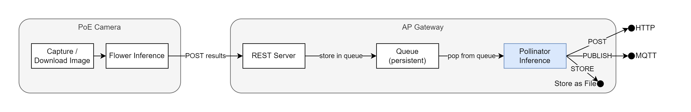

# RPiPollinatorInference

YOLOv5 inference on a Raspberry Pi 4 (64 Bit).


The application requests preprocessed records from the [ZMQMessageQueue](https://github.com/WullT/ZMQMessageQueue).




## Installation

Clone the repo
```sh
cd ~
git clone https://github.com/WullT/RPiPollinatorInference.git
```


Install requirements
```sh
cd ~/RPiPollinatorInference
pip3 install -r requirements.txt
```

Edit config file
```sh
cd ~/RPiPollinatorInference
cp config_example.yaml config.yaml
nano config.yaml
```

Start with
```sh
python3 main.py --config path/to/config.yaml # default ./config.yaml
```

Run as a service
```sh
sudo cp ~/RPiPollinatorInference/pollinatorinference.service /etc/systemd/system/pollinatorinference.service
sudo systemctl daemon-reload
sudo systemctl enable pollinatorinference.service
sudo systemctl start pollinatorinference.service
# and check the status with
sudo systemctl status pollinatorinference.service
```

## Configuration

### Input (ZMQ)

The ZMQ Server endpoint.

```yaml
zmq:
  host: localhost
  port: 5557
  request_timeout: 3000
  request_retries: 5
```

### Model

```yaml
model:
  weights_path: models/pollinators_s.pt
  local_yolov5_path: /home/pi/yolov5
  class_names: ["honigbiene", "wildbiene","hummel","schwebfliege","fliege"]
  confidence_threshold:  0.25
  iou_threshold: 0.5
  max_detections: 10
  margin: 40
  multi_label: true
  multi_label_iou_threshold: 0.7
  augment: false
```

| Option                      | Description                                                                        |
| --------------------------- | ---------------------------------------------------------------------------------- |
| `weights_path`              | path to the model `.pt` file                                                       |
| `local_yolov5_path`         | path to a local yolov5 repo (optional)                                             |
| `class_names`               | an array of class names (class_id[0] = class_names[0])                             |
| `confidence_threshold`      | nms confidence threshold                                                           |
| `iou_threshold`             | nms iou threshold                                                                  |
| `max_detections`            | max objects to detect in an image                                                  |
| `margin`                    | add a margin to the objects for cropping (in pixel)                                |
| `multi_label`               | enable multiple predictions for the same objects                                   |
| `multi_label_iou_threshold` | iou threshold to decide wether two detected objects are the same object            |
| `augment`                   | inference-time augmentation (see https://github.com/ultralytics/yolov5/issues/303) |


### Outputs

Where to send / store the results.

The output file is in JSON format, images are base64-encoded.

The filename consists of the node_id and the record date.


if `output.ignore_empty_results` is set to true, results without detections will be ignored.

```yaml
output:
  ignore_empty_results: false
```

#### File

Store the result files locally.
This will generate a directory structure as follows:
```
<base_dir>/<node_id>/<date>/<hour>/<filename>.json
```

```yaml
output:
  file:
    store_file: true
    base_dir: output
    save_crops: true
```

#### HTTP

Transmit results to a HTTP endpoint.

```yaml
output:
  http:
    transmit_http: true
    url: http://localhost:8080/api/v1/pollinators/${node_id}
    method: POST
    username: admin
    password: admin
```

#### MQTT

Publish results to an MQTT broker.

```yaml
output:
  mqtt:
    transmit_mqtt: true
    host: mqtt.example.com
    port: 8883
    username: mqtt_user
    password: mqtt_password
    topic: "results/${hostname}/json"
    use_tls: true
```

#### Placeholders

In `output.http.url` and `output.mqtt.topic`, following placeholders are available

| Placeholder   | will be replaced with                                 |
| ------------- | ----------------------------------------------------- |
| `${filename}` | the generated filename `<node_id>_<time_string>.json` |
| `${node_id}`  | the id of the node which captured the image           |
| `${hostname}` | the hostname of the raspberry pi                      |


## Data formats

### Input

The input is expected in JSON format, images must be base64-encoded.
The file contains of a `detections` array and a metadata dict.

Sample imput (trimmed)
```json
{
    "detections": [
        {
            "class_name": "flockenblume",
            "score": 0.9551437497138977,
            "crop": "/9j/4AAQSkZJRgABAQAAAQABAAD/2wBDA..."
        }
    ],
    "metadata": {
        "flower_inference": {
            "confidence_threshold": 0.2,
            "iou_threshold": 0.5,
            "margin": 20,
            "model_name": "flowers_ds_v5_640_yolov5n_v0_cnv-fp16.tflite",
            "max_det": 25,
            "total_inference_time": 1.624406337738037,
            "capture_size": [
                4656,
                3496
            ],
            "time_download": 2.854959487915039,
            "node_id": "3200-5030",
            "capture_time": "2022-07-07 08:48:18.108219"
        }
    },
}
```

### Output

Field|description
-|-
`flowers`|an array of flower objects (directely from the input file)
`flowers.index`| an index for each flower
`flowers.class_name`|type of the flower
`flowers.score`|the score of the flower detection model
`flowers.width` / `flowers.height` | dimensions of the cropped flower image
`pollinators`| an array of detected pollinators
`pollinators.index`| the index of the pollinator if `multi_label` is set to true, multiple pollinator entries can have the same index
`pollinators.flower_index` | the index of the flower on which the pollinator was detected
`pollinators.class_name` | the class name of the detected pollinator
`pollinators.score` | the confidence of the detection
`pollinators.width` / `pollinators.height` | dimensions of the detected pollinator
`pollinators.crop` | the crop of the pollinator (base64 encoded)
`timestamp`|capture timestamp of the image
`node_id`|id of the node that captured the image
`metadata.flower_inference`|metadata of the flower inference (directely from input file)
`metadata.pollinator_inference`|metadata of the pollinator inference


Sample output (trimmed)
```json
{
    "flowers": [
        {
            "index": 0,
            "class_name": "flockenblume",
            "score": 0.9837055802345276,
            "width": 927,
            "height": 942
        },
        {
            "index": 1,
            "class_name": "flockenblume",
            "score": 0.9385321140289307,
            "width": 932,
            "height": 980
        }
    ],
    "pollinators": [
        {
            "index": 0,
            "flower_index": 0,
            "class_name": "honigbiene",
            "score": 0.5825711488723755,
            "width": 440,
            "height": 349,
            "crop": "/9j/4A...h4ooqkFz//Z"
        }
    ],
    "timestamp": "2022-07-04 15:15:50.609762",
    "node_id": "3200-5030",
    "metadata": {
        "pollinator_inference": {
            "confidence_threshold": 0.25,
            "iou_threshold": 0.5,
            "margin": 40,
            "multi_label": true,
            "multi_label_iou_threshold": 0.7,
            "model_name": "pollinators_s.pt",
            "max_det": 10,
            "augment": false,
            "total_inference_time": 2.148534059524536,
            "average_inference_time": 1.074267029762268
        },
        "flower_inference": {
            "confidence_threshold": 0.2,
            "iou_threshold": 0.5,
            "margin": 20,
            "model_name": "flowers_ds_v5_640_yolov5n_v0_cnv-fp16.tflite",
            "total_inference_time": 1.5990180969238281,
            "capture_size": [
                4656,
                3496
            ],
            "time_download": 2.8631110191345215
        }
    }
}
```
